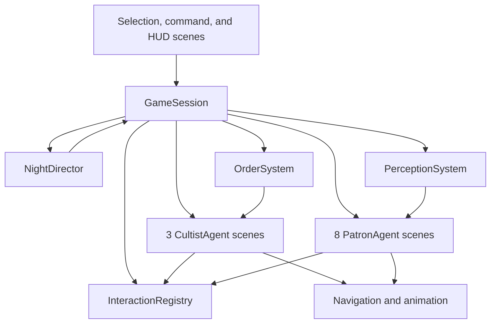
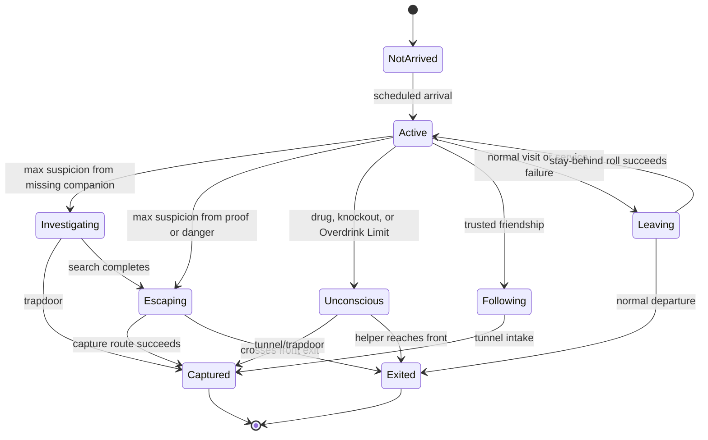
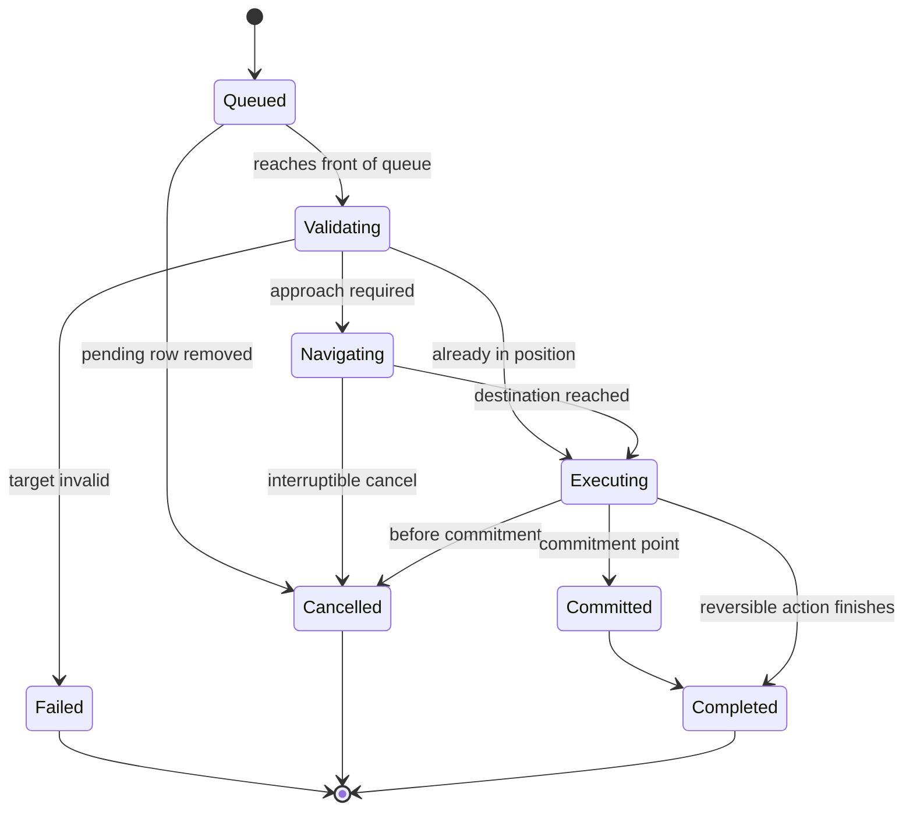
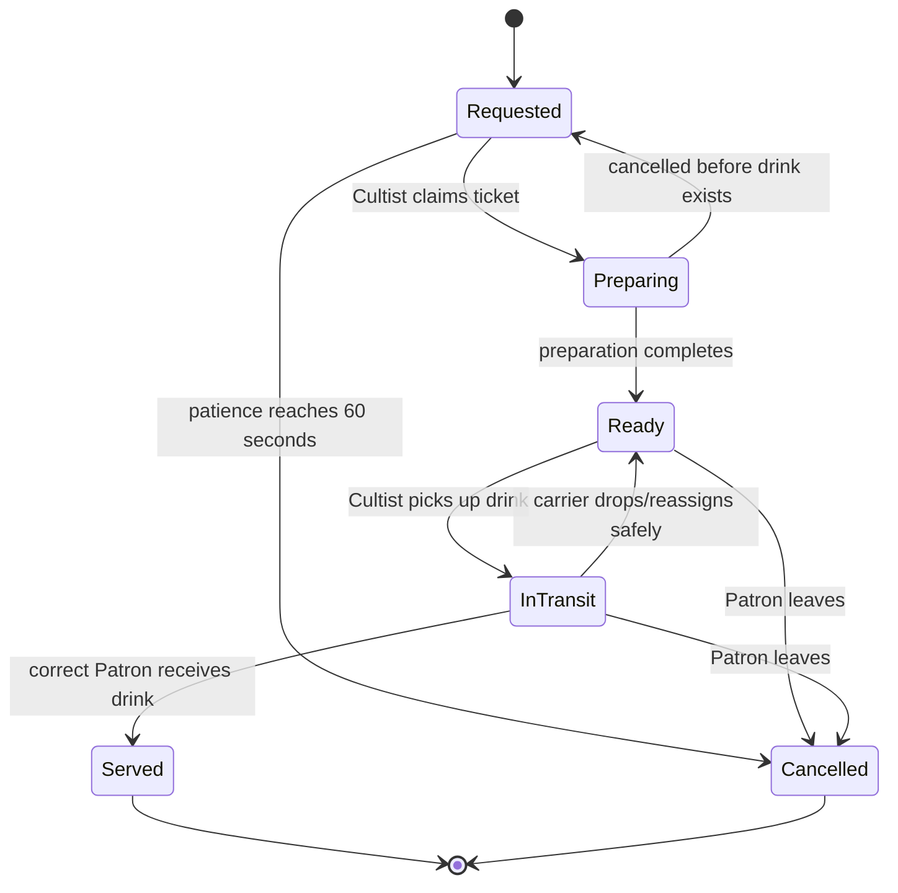

# Under the Bridge — Technical Design and State Model

## 1. Goals and constraints

The architecture must support one authored Night with three Cultists and eight Patrons, remain readable to a solo developer, and make the critical gameplay chains testable without building a general simulation framework.

Constraints:

- Godot 4.7.1 and statically typed GDScript
- Blender 5.2 environment pipeline
- one authoritative runtime state for every actor
- pause, 1x, 2x, and 4x simulation
- no autonomous Capture Actions
- settings persistence only
- lean tests at stable interfaces and critical cross-system paths

## 2. Scene and module shape



`GameSession` is the composition root. It creates dependencies, owns the Night seed, routes explicit commands and reported events, and exposes the session snapshot to UI. It is not a global event bus.

### 2.1 Deep modules and interfaces

**NightDirector**

- Interface: advance simulated time, record terminal events, return phase/outcome snapshot.
- Hides: phase transitions, arrival schedule, Closing, Capture quota, results metrics, and defeat checks.
- Invariant: only a maximum-suspicion Escape crossing the front exit causes immediate defeat.

**CultistCommandSystem**

- Interface: reset for a new Night, register an authored smart object, resolve context options, issue a command in Replace or Append mode with an adjacency fact, cancel by stable Action id, accept navigation and proximity results, revalidate targets, report the active request, return normal/debug snapshots.
- Hides: the command catalog, unlimited Action Queue lifecycle, Action Chain policy, Generated Move insertion, target revalidation, the Commitment Point, execution dispatch, cascade rules, and reservation transfer.
- Invariant: one active Action precedes any number of pending Actions; queue length never rejects a valid command; one Action Chain shares one stable identity; the gameplay effect fires exactly once at the Commitment Point.
- Boundary: `GameSession` owns every eligibility rule and operation. The scene adapter supplies current position, live Approach Position, and adjacency, then drives navigation. The command seam decides whether to create a Generated Move and how to change a chain. Target references carry kind, id, position, and approach slot — never a scene node. See ADR 0002 and `docs/adr/0003-use-visible-action-chains.md`.

**NightPlayback**

- Interface: reset with a real `GameSession`, submit one playback intent, synchronize after simulation changes, and return a display-ready snapshot.
- Hides: selected Simulation Speed, Plain Pause, Pause Menu return state, Escape lock synchronization, accepted no-op speed selection, and repeated feedback serials.
- Invariant: `GameSession.set_time_scale()` remains the only authority; the selected speed changes only after acceptance; Plain Pause does not clear the selected speed.
- Boundary: keyboard and Bottom HUD intents cross this module. The Bottom HUD renders only the accepted snapshot. The Pause Menu and Outcome Modal keep their existing input blocks.

**EmoteDirector**

- Interface: reset for a new Night, update from the sanitized `emote_view` with a real delta and the paused flag, return the current bubble descriptions.
- Hides: the emote catalog, state diffing, transient creation, priority, preemption, deduplication, queue limits, duration, and deterministic ordering.
- Invariant: one bubble for each actor and at most two waiting transients; a critical persistent state suppresses every transient; nothing here changes gameplay.
- Boundary: the module reads only `GameSession.emote_view()`. That projection carries actor id, kind, presence, one public state, public band labels, and public change events. Debug Patron views, raw rolls, exact Suspicion, Mood, Bladder, Ideal Intoxication, Overdrink Limit, Excess Drinks, hidden drug state, reservations, and internal timers never cross it. `EmoteOverlay` is a thin screen-space adapter that projects head anchors and solves placement; it owns no gameplay or priority rule.

**PatronAgent**

- Interface: apply observation/stimulus, request intent change, return visible snapshot.
- Hides: needs, activity transitions, Suspicion, Friendship, companion knowledge, drug countdown, Investigation, Escape, and Capture eligibility.
- Invariant: `Captured` and `Exited` are terminal and mutually exclusive.

**PatronBehaviorMachine**

- Interface: submit typed intent, advance simulated time, return emitted events and current snapshot.
- Hides: the hierarchical transition table, behavior priority, preemption, deferred intents, committed phases, state entry and exit, and reservation cleanup.
- Invariant: every accepted transition exits the old state and releases its obsolete reservation before the new state acquires one; terminal states reject later intents.

**InteractionRegistry**

- Interface: request named slot, release actor, query next waiter.
- Hides: seat ownership, bar positions, bathroom occupancy, authored queue positions, approach transforms, and cleanup after cancellation.
- Invariant: a slot has at most one owner; an actor holds at most one exclusive destination reservation.

**OrderSystem**

- Interface: place Order, claim preparation, mark ready, assign carrier, serve, cancel.
- Hides: ticket timing, Prepared Drink ownership, payment, tips, and failed-service consequences.
- Invariant: one Order reaches exactly one terminal state: served or cancelled.

**PerceptionSystem**

- Interface: report visual event, report sound event, advance ambient pressure.
- Hides: facing and line-of-sight checks, room hearing, Unattended Body accumulation, and companion influence.
- Invariant: Hard Evidence normally creates permanent maximum Suspicion, but a Max Drunk observer downgrades each event to +25 soft Suspicion before it reaches the Patron state transition.

**Rules modules**

Suspicion, Rescue Persuasion, staying-behind, payment, and outcome calculations are pure functions over values. They return results rather than mutating scene nodes. Randomized rules accept the seeded random source rather than creating one.

## 3. Runtime data ownership

Immutable Godot `Resource` definitions contain authored Patron profiles, timings, Action definitions, interaction types, and tunable values. Mutable per-Night state lives in its owning module or actor scene, never in shared Resources.

Recommended identifiers are typed `StringName` values or small value objects rather than Node paths persisted as domain identity.

No state is duplicated in UI. UI reads snapshots and submits commands.

Normal Patron snapshots expose Observable Status before identification. After a Talk Action identifies a Patron for the crew, they also expose name, Ideal Intoxication, Arrival Group, relevant Friendship band, and qualitative victim value/risk. They exclude Bladder, exact probability/value/timer data, hidden causes, Overdrink Limit, Excess Drink count, reservations, navigation, and random state.

Debug snapshots may additionally expose exact Bladder and next bathroom-check probability, Intoxication decay, Ideal Intoxication, Overdrink Limit, Excess Drink count, patience/Mood, Suspicion cause and recovery, complete Friendship values, lifecycle/activity, reservations, navigation, Action progress, seed, and recent rolls.

The selected Cultist snapshot includes stable Action identifiers for the active and pending rows. The HUD removes a pending Action by identifier or requests cancellation of the active Action; a committed active Action reports cancellation unavailable.

## 4. Simulation time and randomness

A central simulation clock in `GameSession` owns pause and speed. All gameplay durations consume its scaled delta. Individual actors must not use wall-clock time or uncoordinated `Timer` nodes.

`NightPlayback` owns interactive transitions and exposes the selected speed separately from the accepted current scale. Navigation and animation receive the accepted scale while UI continues during Plain Pause. A new interactive Night starts at 1x. Escape forces 1x and reduces the available scales to pause and 1x. The Pause Menu records and restores the prior state on dismissal, while Resume starts the selected speed.

Each Night has one seed. Rescue Persuasion, staying-behind, bathroom choice, Ideal Intoxication, Overdrink Limit, Offer Drink acceptance, social intervals, and Companion Mood reactions draw from the injected seeded random source. Results and failures record the seed for reproduction.

## 5. World representation

- Root gameplay world: `Node3D`
- Actors: `CharacterBody3D` with upright `AnimatedSprite3D`
- Movement: `NavigationAgent3D` over one baked `NavigationRegion3D`
- Camera: fixed low-elevated long-lens perspective view, square to the bar/backbar wall; pan and zoom only, with authored foreground-wall cutaways
- Functional locations: authored interaction-point scenes with approach transforms
- Queues: authored positions managed by `InteractionRegistry`
- Tunnel: terminal threshold, not a playable scene

Actor movement is constrained to the floor plane. Animation state is selected from logical activity and movement; animation events never own gameplay consequences.

The navigation spike validated flat-plane `NavigationAgent3D` path following with 2D RVO avoidance and physical actor collision as a fallback. Path updates occur once per physics frame. A four-simulated-second no-progress interval requests a fresh path; fifteen simulated seconds without progress is a measured stuck failure. Production geometry should use a pre-baked static navigation mesh; runtime collision-geometry baking exists only in the spike harness.

Cultists move at 1.5 meters per second and Patrons at 1.3 meters per second. Escape applies 140% Patron speed, Helper movement 60%, and dragging 50% Cultist speed. A blocked Cultist Action fails after the measured fifteen-second limit; Patron emergency movement retries from the nearest valid waiting position.

## 6. State models

Patron behavior uses the table-driven hierarchical state machine recorded in [ADR 0001](adr/0001-centralize-patron-behavior-transitions.md). Callers submit intents and consume events; they do not inspect the current state to choose a transition. The transition table classifies each state-intent pair as accept, defer, or reject and records a reason. State entry and exit handlers apply the resulting reservation and lifecycle effects in one place.

### 6.1 Patron lifecycle



Within `Active`, a Patron has one activity intent:

- entering
- finding seat
- awaiting Order
- awaiting drink
- drinking
- socializing
- going to bathroom
- queueing
- entering bathroom
- seated bathroom use
- standing bathroom exit
- supporting a collapsed Companion

Needs and conditions such as Bladder, Intoxication, drug countdown, Friendship, and Suspicion are orthogonal data, not separate state machines. Bladder schedules a decision check every 5 simulated seconds only while the Patron is eligible; Intoxication stores its level and time until the next four-minute decay.

### 6.2 Suspicion bands

| Value | Band | Transition consequence |
|---:|---|---|
| 0-24 | Calm | None |
| 25-49 | Uneasy | Concern presentation |
| 50-74 | Suspicious | Attention and persuasion penalty |
| 75-99 | Alarmed | Stops Orders; seeks companions/front area |
| 100 | Maximum | Cause selects Investigation or Escape |

Suspicion keeps a cause classification:

- `soft`: recoverable after quiet
- `missing_companion`: drives Investigation at maximum
- `hard_evidence`: permanent and drives Escape after the Max Drunk observation-time downgrade has been considered
- `general_danger`: drives Escape

### 6.3 Cultist Action lifecycle



An Action definition provides target rules, reservation needs, proximity policy, duration, Commitment Point, visible label, and completion effect. Runtime Actions hold serializable target identity, progress, stable Action id, Action Chain id, chain position, and generated status.

A nonadjacent Patron command creates a Generated Move and requested Action under one Action Chain id. The Generated Move reserves and tracks the Patron's live Approach Position. Its completion transfers the same reservation to the requested Action. Cancellation or failure removes all unfinished chain links and releases the reservation once, then activates the next unrelated Action. A pending Patron Action rechecks proximity when it reaches the queue head and inserts one Generated Move if the Patron moved away.

Dragging is an Action mode that owns the body association until completion or drop. A drop releases navigation/interaction reservations and makes the victim Unattended after the grace period.

### 6.4 Order lifecycle



The first prototype may simplify reassignment presentation, but ownership and terminal-state invariants remain.

### 6.5 Bathroom occupancy

The registry owns one occupant slot and one FIFO Bathroom Line slot. Additional Patrons retain bathroom intent at their seats until the line opens. The Patron activity owns phase timing:

1. 2 seconds standing entry
2. 8 seconds seated use
3. 3 seconds standing exit

The Trapdoor owns a 2-second open pulse and 3-second cooldown. It queries occupant posture at activation and opening ticks; it does not arm a future fall.

The bathroom danger-chain spike fixes the implementation rule behind that invariant: each activation stores the occupant identifier present when the pulse begins. Only that Patron can be captured by that pulse. Capture, cancellation, or queue promotion never transfers eligibility to the next occupant. A sober seated witness receives maximum Suspicion but remains seated; after completing the bathroom exit phase, that Patron begins the direct Escape branch. The Max Drunk `+25` downgrade does not create that pending Escape unless accumulated Suspicion independently reaches maximum.

An eligible Patron at 50% or greater Bladder performs a seeded bathroom-choice check every 5 simulated seconds. Probability interpolates linearly from 1% at 50% to 90% at 100%. Selecting the intent stops further checks until the bathroom visit resolves; completing use sets Bladder to zero.

## 7. Critical event flows

### 7.1 Missing Companion to defeat

1. Companion enters the bathroom; group knowledge starts the absence clock.
2. At 20 and 30 seconds, apply +25 Suspicion events.
3. At 40 seconds, set the worried Patron to maximum and `Investigating`.
4. Investigator reserves the next bathroom access, enters, and searches standing for 5 seconds.
5. Trapdoor Capture can resolve the threat during the search.
6. Otherwise the search discovers the Trapdoor and changes the Patron to `Escaping`.
7. Escape forces 1x and permits one 5-second Intercept.
8. Crossing the front exit records immediate defeat.

### 7.2 Collapse with Helper

1. A Drugged Drink, knockout, or Overdrink Limit changes the Patron to `Unconscious`.
2. Each conscious same-room Companion makes the seeded Mood-reaction roll.
3. After 2 seconds, the least Intoxicated conscious, non-Miserable same-room Companion claims the Helper role; authored order breaks ties.
4. Helper supports the victim after a 4-second lift and moves at 60% toward the front.
5. Rescue Persuasion may run once for 6 seconds.
6. Success routes Helper and victim to Tunnel Intake and captures both.
7. Failure adds 25 Suspicion and resumes front-exit movement.

## 8. Perception rules

- Visual events require a configured view range, facing test, and unobstructed ray to the event.
- Sound events target Patrons in the configured room/hearing relationship.
- A non-Overdrink Unattended Body affects only Patrons who can see it after the body's 3-second grace period.
- An Overdrink body causes a one-time same-room Mood reaction instead of collapse or unattended-body Suspicion; dragging it uses half the normal Suspicion values.
- Companion influence applies every 10 seconds within 5 meters and the same room, targets the highest nearby group value, and adds at most 5.
- Perception emits domain stimuli; it does not directly choose Patron states.

## 9. Core formulas and timings

| Rule | Definition |
|---|---|
| Rescue Persuasion | clamp(25 + 0.7 x (Friendship - Suspicion), 5, 95)% |
| Stay behind | clamp(10 + 0.5 x Bartender Friendship + 15 x Intoxication - 0.6 x Suspicion, 0, 90)% |
| Bathroom choice | every 5s when eligible: clamp(1 + 89 x ((Bladder - 50) / 50), 1, 90)% |
| Intoxication decay | -1 level after each 4 minutes without completing a drink |
| Hard Evidence | permanent 100 normally; +25 soft while observer is Max Drunk |
| Soft recovery | after 20 quiet seconds, -5 per 10 seconds |
| Unattended Body | after 3 seconds, +5 per visible non-Overdrink body every 5 seconds |
| Companion influence | every 10 seconds, +up to 5 toward highest nearby group member |
| Trapdoor | open 2 seconds, cooldown 3 seconds |
| Bathroom | standing 2, seated 8, standing 3 seconds |
| Missing Companion | +25 at 20s, +25 at 30s, maximum at 40s |
| Drugged Drink | drowsy at 10s, unconscious at 20s |
| Escape | 2s shock, 140% movement, one 5s Intercept |

## 10. Persistence and restart

Only settings persist. Starting or restarting a Night constructs fresh runtime state from immutable definitions and a new seed. Restart must release all reservations, queues, signals, timers, Prepared Drinks, and spawned actors rather than reusing contaminated scene state.

## 11. Lean verification strategy

Tests protect interfaces and high-risk chains, not every implementation path.

Automate only:

- formula bounds and representative Suspicion/Friendship/stay cases
- representative bathroom-choice bounds and deterministic seeded roll
- Action Queue replace, Shift-append, pending-row removal, pre/post-Commitment cancellation, and invalid-target progression
- unlimited Action Queue order, stable Action Chain metadata, Generated Move insertion, cascade cancellation/failure, and unrelated progression
- context resolution and one success plus one ineligible path for every catalog command
- approach-slot contention producing one owner and one visible rejection
- reservation transfer across Generated Move and its requested Patron Action without a release gap
- the complete `NightPlayback` transition table against a real `GameSession`
- the Bottom HUD intent to `NightPlayback` to `GameSession` to rendered HUD integration route
- the normal command snapshot and menu labels carrying no hidden simulation value
- emote priority, preemption, transient timing, pause, deduplication, and reset
- a recursive forbidden-key scan proving `emote_view` carries no hidden simulation value
- exclusive reservation and bathroom FIFO invariants
- Order served versus 60-second cancellation/payment behavior
- seated versus standing Trapdoor result, including Max Drunk Hard Evidence downgrade
- missing Companion to Investigation to Escape/defeat chain
- collapse Mood reaction and Helper success/failure chain
- results outcome for quota success, quota failure, and maximum-Suspicion escape
- clean restart releasing runtime state

GUT 9.7.1 is pinned in the repository. Run the lean suite through `tools/test_headless.ps1` and record random seeds. Do not add tests for animation timing, UI layout, tunable values in isolation, trivial accessors, every state permutation, or incidental implementation details unless a regression demonstrates value.

The visual/import and 11-agent movement spikes remain measured scenarios rather than exhaustive automated tests.

## 12. Planned project structure

```text
scenes/
  game_session.tscn
  world/
  actors/
  interactions/
  ui/
scripts/
  session/
  cultists/
  patrons/
  interactions/
  orders/
  perception/
  rules/
resources/
  patrons/
  actions/
  tuning/
tests/
  rules/
  modules/
  scenarios/
```

Folders follow domain ownership. Avoid generic `managers`, `helpers`, and `utils` folders.

## 13. Technical decisions still owned by spikes

The following are deliberately not fixed before measurement:

- exact Godot material/shadow settings for pixel sprites
- final camera distance, field of view, and pixel scale
- whether repeated high-poly props require reduction
- whether the simulation clock uses an engine time-scale adapter or shared scaled delta internally
- exact line-of-sight range and cone angle

These variations stay behind existing module interfaces; spike outcomes must not widen caller knowledge.
