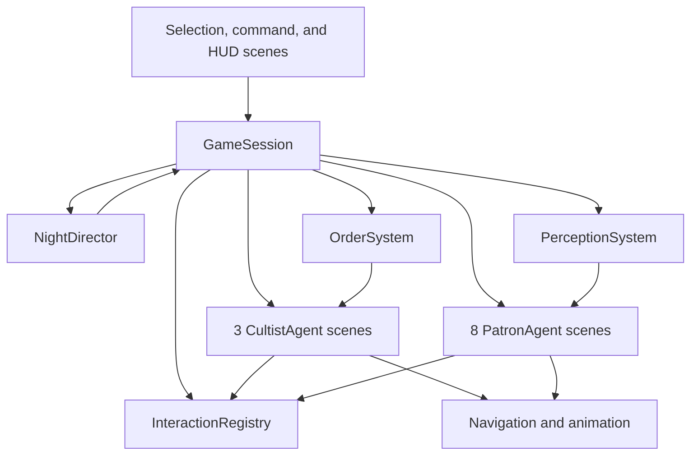
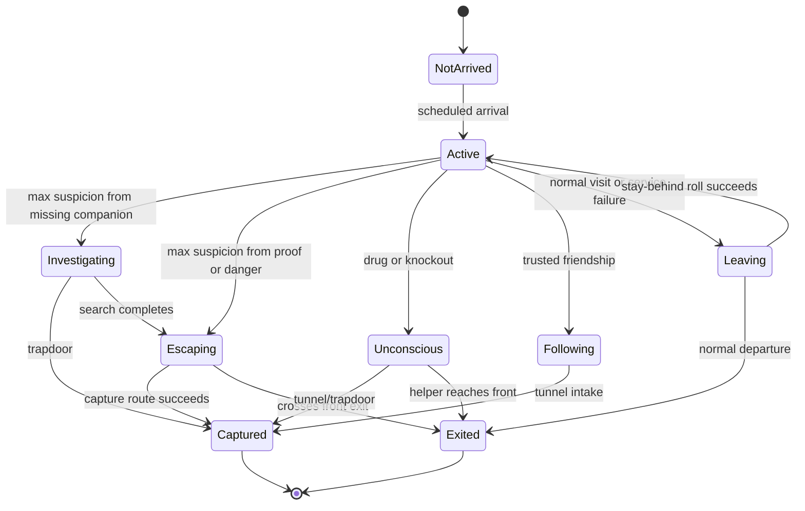
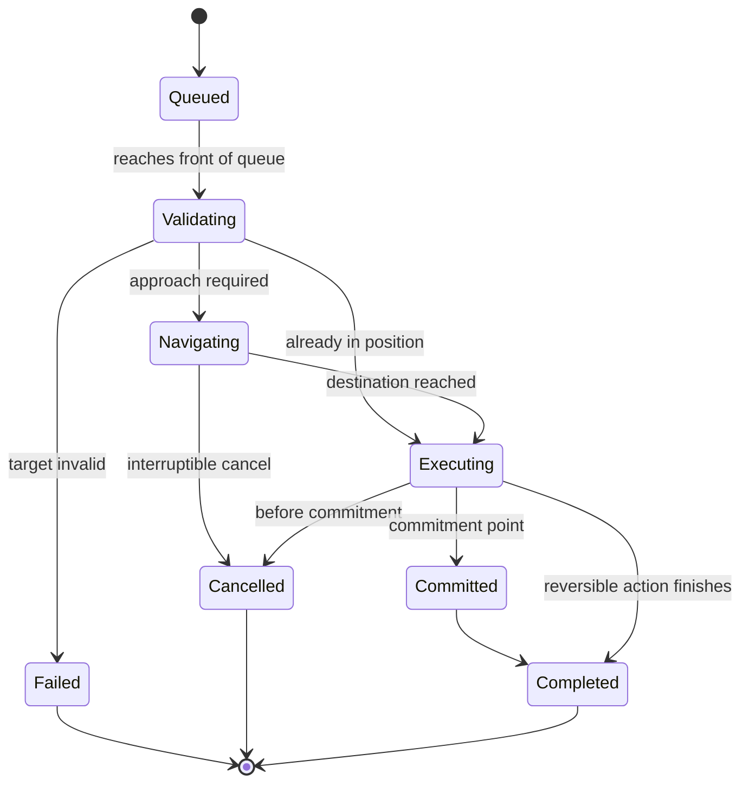
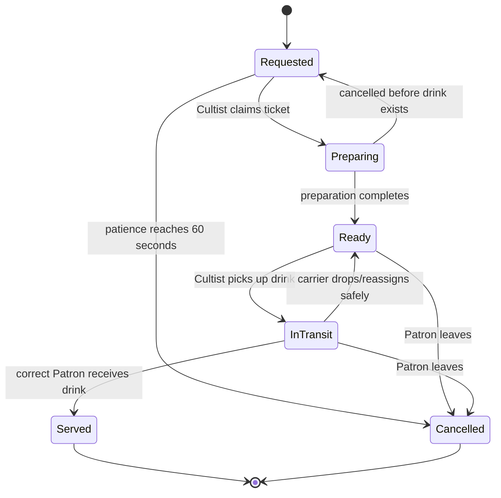

# Under the Bridge — Technical Design and State Model

## 1. Goals and constraints

The architecture must support one authored Night with three Cultists and eight Patrons, remain readable to a solo developer, and make the critical gameplay chains testable without building a general simulation framework.

Constraints:

- Godot 4.7.1 and statically typed GDScript
- Blender 5.2 environment pipeline
- one authoritative runtime state for every actor
- pause, 1x, 2x, and 4x simulation
- no autonomous Capture Actions
- settings persistence only
- lean tests at stable interfaces and critical cross-system paths

## 2. Scene and module shape



`GameSession` is the composition root. It creates dependencies, owns the Night seed, routes explicit commands and reported events, and exposes the session snapshot to UI. It is not a global event bus.

### 2.1 Deep modules and interfaces

**NightDirector**

- Interface: advance simulated time, record terminal events, return phase/outcome snapshot.
- Hides: phase transitions, arrival schedule, Closing, Capture quota, results metrics, and defeat checks.
- Invariant: only a maximum-suspicion Escape crossing the front exit causes immediate defeat.

**CultistAgent**

- Interface: enqueue Action, do-now Action, cancel current Action, return visible snapshot.
- Hides: queue validation, Commitment Points, pathing, interaction execution, failure reasons, and safe autonomy.
- Invariant: one active plus at most three pending Actions; autonomy never enqueues Capture Actions.

**PatronAgent**

- Interface: apply observation/stimulus, request intent change, return visible snapshot.
- Hides: needs, activity transitions, Suspicion, Friendship, companion knowledge, drug countdown, Investigation, Escape, and Capture eligibility.
- Invariant: `Captured` and `Exited` are terminal and mutually exclusive.

**InteractionRegistry**

- Interface: request named slot, release actor, query next waiter.
- Hides: seat ownership, bar positions, bathroom occupancy, authored queue positions, approach transforms, and cleanup after cancellation.
- Invariant: a slot has at most one owner; an actor holds at most one exclusive destination reservation.

**OrderSystem**

- Interface: place Order, claim preparation, mark ready, assign carrier, serve, cancel.
- Hides: ticket timing, Prepared Drink ownership, payment, tips, and failed-service consequences.
- Invariant: one Order reaches exactly one terminal state: served or cancelled.

**PerceptionSystem**

- Interface: report visual event, report sound event, advance ambient pressure.
- Hides: facing and line-of-sight checks, room hearing, Unattended Body accumulation, and companion influence.
- Invariant: Hard Evidence is never converted back into soft Suspicion.

**Rules modules**

Suspicion, Rescue Persuasion, staying-behind, payment, and outcome calculations are pure functions over values. They return results rather than mutating scene nodes. Randomized rules accept the seeded random source rather than creating one.

## 3. Runtime data ownership

Immutable Godot `Resource` definitions contain authored Patron profiles, timings, Action definitions, interaction types, and tunable values. Mutable per-Night state lives in its owning module or actor scene, never in shared Resources.

Recommended identifiers are typed `StringName` values or small value objects rather than Node paths persisted as domain identity.

No state is duplicated in UI. UI reads snapshots and submits commands.

## 4. Simulation time and randomness

A central simulation clock owns pause and speed. All gameplay durations consume its scaled delta. Individual actors must not use wall-clock time or uncoordinated `Timer` nodes.

Navigation and animation receive the same speed state while UI continues processing during pause. Starting Escape requests 1x. The movement spike decides whether speed is implemented through a shared scaled delta or a safe engine time-scale adapter; callers do not depend on that choice.

Each Night has one seed. Rescue Persuasion and staying-behind checks draw from the injected seeded random source. Results and failures record the seed for reproduction.

## 5. World representation

- Root gameplay world: `Node3D`
- Actors: `CharacterBody3D` with upright `AnimatedSprite3D`
- Movement: `NavigationAgent3D` over one baked `NavigationRegion3D`
- Camera: fixed high-angle perspective; pan and zoom only
- Functional locations: authored interaction-point scenes with approach transforms
- Queues: authored positions managed by `InteractionRegistry`
- Tunnel: terminal threshold, not a playable scene

Actor movement is constrained to the floor plane. Animation state is selected from logical activity and movement; animation events never own gameplay consequences.

## 6. State models

### 6.1 Patron lifecycle



Within `Active`, a Patron has one activity intent:

- entering
- finding seat
- awaiting Order
- awaiting drink
- drinking
- socializing
- going to bathroom
- queueing
- entering bathroom
- seated bathroom use
- standing bathroom exit
- supporting a collapsed Companion

Needs and conditions such as Bladder, Intoxication, drug countdown, Friendship, and Suspicion are orthogonal data, not separate state machines.

### 6.2 Suspicion bands

| Value | Band | Transition consequence |
|---:|---|---|
| 0-24 | Calm | None |
| 25-49 | Uneasy | Concern presentation |
| 50-74 | Suspicious | Attention and persuasion penalty |
| 75-99 | Alarmed | Stops Orders; seeks companions/front area |
| 100 | Maximum | Cause selects Investigation or Escape |

Suspicion keeps a cause classification:

- `soft`: recoverable after quiet
- `missing_companion`: drives Investigation at maximum
- `hard_evidence`: permanent and drives Escape
- `general_danger`: drives Escape

### 6.3 Cultist Action lifecycle



An Action definition provides target rules, reservation needs, approach distance, duration, Commitment Point, visible label, and completion effect. Runtime Actions hold target identity and progress.

Dragging is an Action mode that owns the body association until completion or drop. A drop releases navigation/interaction reservations and makes the victim Unattended after the grace period.

### 6.4 Order lifecycle



The first prototype may simplify reassignment presentation, but ownership and terminal-state invariants remain.

### 6.5 Bathroom occupancy

The registry owns one occupant slot and two FIFO queue slots. The Patron activity owns phase timing:

1. 2 seconds standing entry
2. 8 seconds seated use
3. 3 seconds standing exit

The Trapdoor owns a 2-second open pulse and 3-second cooldown. It queries occupant posture at activation and opening ticks; it does not arm a future fall.

## 7. Critical event flows

### 7.1 Missing Companion to defeat

1. Companion enters the bathroom; group knowledge starts the absence clock.
2. At 20 and 30 seconds, apply +25 Suspicion events.
3. At 40 seconds, set the worried Patron to maximum and `Investigating`.
4. Investigator reserves the next bathroom access, enters, and searches standing for 5 seconds.
5. Trapdoor Capture can resolve the threat during the search.
6. Otherwise the search discovers the Trapdoor and changes the Patron to `Escaping`.
7. Escape forces 1x and permits one 5-second Intercept.
8. Crossing the front exit records immediate defeat.

### 7.2 Drug collapse with Helper

1. Consumer starts a 20-second countdown at first sip.
2. At 10 seconds, report drowsiness; at 20, enter `Unconscious`.
3. Strongest available Companion claims the Helper role after 2 seconds.
4. Helper supports the victim after a 4-second lift and moves at 60% toward the front.
5. Rescue Persuasion may run once for 6 seconds.
6. Success routes Helper and victim to Tunnel Intake and captures both.
7. Failure adds 25 Suspicion and resumes front-exit movement.

## 8. Perception rules

- Visual events require a configured view range, facing test, and unobstructed ray to the event.
- Sound events target Patrons in the configured room/hearing relationship.
- Unattended Body pressure is global to active Patrons after each body's 3-second grace period.
- Companion influence applies every 10 seconds within 5 meters and the same room, targets the highest nearby group value, and adds at most 5.
- Perception emits domain stimuli; it does not directly choose Patron states.

## 9. Core formulas and timings

| Rule | Definition |
|---|---|
| Rescue Persuasion | clamp(25 + 0.7 x (Friendship - Suspicion), 5, 95)% |
| Stay behind | clamp(10 + 0.5 x Bartender Friendship + 15 x Intoxication - 0.6 x Suspicion, 0, 90)% |
| Soft recovery | after 20 quiet seconds, -5 per 10 seconds |
| Unattended Body | after 3 seconds, +5 per body to all active Patrons every 5 seconds |
| Companion influence | every 10 seconds, +up to 5 toward highest nearby group member |
| Trapdoor | open 2 seconds, cooldown 3 seconds |
| Bathroom | standing 2, seated 8, standing 3 seconds |
| Missing Companion | +25 at 20s, +25 at 30s, maximum at 40s |
| Drugged Drink | drowsy at 10s, unconscious at 20s |
| Escape | 2s shock, 140% movement, one 5s Intercept |

## 10. Persistence and restart

Only settings persist. Starting or restarting a Night constructs fresh runtime state from immutable definitions and a new seed. Restart must release all reservations, queues, signals, timers, Prepared Drinks, and spawned actors rather than reusing contaminated scene state.

## 11. Lean verification strategy

Tests protect interfaces and high-risk chains, not every implementation path.

Automate only:

- formula bounds and representative Suspicion/Friendship/stay cases
- Action Queue append, do-now, pre/post-Commitment cancellation, and invalid-target progression
- exclusive reservation and bathroom FIFO invariants
- Order served versus 60-second cancellation/payment behavior
- seated versus standing Trapdoor result, including Max Drunk witness exception
- missing Companion to Investigation to Escape/defeat chain
- Drugged Drink Helper success/failure chain
- results outcome for quota success, quota failure, and maximum-Suspicion escape
- clean restart releasing runtime state

Use GUT 9.7.1, pinned in the repository when implementation begins. Run tests headlessly and record random seeds. Do not add tests for animation timing, UI layout, tunable values in isolation, trivial accessors, every state permutation, or incidental implementation details unless a regression demonstrates value.

The visual/import and 11-agent movement spikes remain measured scenarios rather than exhaustive automated tests.

## 12. Planned project structure

```text
scenes/
  game_session.tscn
  world/
  actors/
  interactions/
  ui/
scripts/
  session/
  cultists/
  patrons/
  interactions/
  orders/
  perception/
  rules/
resources/
  patrons/
  actions/
  tuning/
tests/
  rules/
  modules/
  scenarios/
```

Folders follow domain ownership. Avoid generic `managers`, `helpers`, and `utils` folders.

## 13. Technical decisions still owned by spikes

The following are deliberately not fixed before measurement:

- exact Godot material/shadow settings for pixel sprites
- final camera distance, field of view, and pixel scale
- whether repeated high-poly props require reduction
- navigation avoidance tuning at 4x
- whether the simulation clock uses an engine time-scale adapter or shared scaled delta internally
- exact line-of-sight range and cone angle

These variations stay behind existing module interfaces; spike outcomes must not widen caller knowledge.
