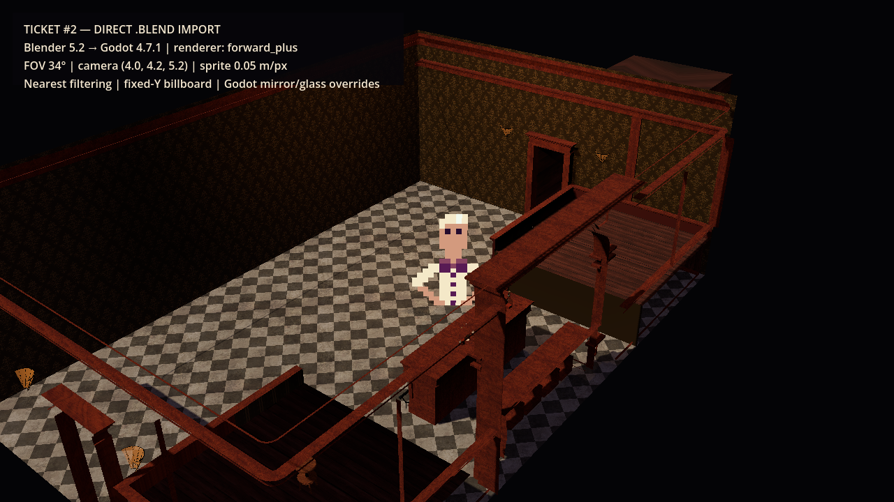

# Ticket #2 — Visual/import spike

## Question and verdict

**Question:** Can the editable Speakeasy Blender source import directly into Godot while preserving a convincing environment, and do the existing pixel characters read clearly inside that 3D scene?

**Verdict:** Pass with known material overrides. Direct `.blend` import and reimport are stable. Opaque textured materials, geometry, orientation, meter scale, and an upright pixel character survive the pipeline. Mirror, bottle glass, and lamp glass require Godot-native materials; a manually maintained `.glb` is unnecessary.

## Evidence frame



This frame is rendered by Godot 4.7.1 from the derived `.blend`, not by Blender. The overlay records the renderer and winning camera/sprite settings.

## Technical frame

- Windows desktop, 1280×720 reference viewport
- Godot 4.7.1 Mono, typed GDScript, Forward+ renderer
- Blender 5.2.0 LTS
- Perspective camera: FOV 34°, position `(4.0, 4.2, 5.2)`, target `(0.15, 0.6, 0.2)`
- Sprite: 0.05 meters per source pixel, nearest filtering, alpha discard, fixed-Y billboard
- Source units: metric at 1.0; preserve 1 Blender unit = 1 Godot meter
- Lighting: low-energy cool ambient, neutral-warm directional key, restrained local bar light

The source room footprint is approximately 3.6×5.4 meters. That scale imports consistently and makes the temporary Bartender readable, but whether eleven agents fit comfortably remains a movement-spike question. Do not rescale the environment before that measurement.

## Source preservation and provenance

| Asset | SHA-256 before and after spike | Treatment |
| --- | --- | --- |
| Pristine `Speakeasy.blend` | `D014B9E00B75CA1BCB3C24A213ABA0A08F17DAF4F95540AC85434F56B3865302` | Read-only source; unchanged |
| Pristine `Bartender.png` | `8539FC5D9261114266EA371F595653AA5A9B16B8102EE69BDF4242D3E63D232F` | Copied for the visual test; unchanged |

The vignette contains 21 named objects and the 12 referenced source textures needed by the migration plan. Existing art is treated as CC0 under the user's explicit assumption; provenance was not independently verified.

## Import findings

1. Godot direct `.blend` import works through Blender's glTF exporter after the editor setting `filesystem/import/blender/blender_path` points to Blender 5.2.
2. The first derived copy revealed that Blender's save-time path remapping could point textures back toward the pristine source. Saving with explicit `//Textures/<filename>` paths and disabled relative remapping fixed it.
3. A 5 cm stool move changed the derived `.blend` hash from `F1E05F24D7BCD573DF09FCAE4A7F74A2B705F73CB80C12A834FAA7A93F56EEC1` to `A03BEB87AB04E88460A7C6787DD8CD2F1DDE0129BB0C03D2D9BEAB51F81DCC80`. Godot detected, reimported, and rerendered it while the pristine source hash remained unchanged.
4. Imported nodes retain source names and material names, making targeted overrides deterministic.
5. Forward+ and Compatibility both render the vignette. Forward+ is the Windows baseline because it introduces no visual regression and supports the reflection features needed by the mirror treatment.

## Material decisions

- Ordinary floor, wall, wood, brass, label, and metal materials may enter through direct import.
- `mirror` imports as an opaque black panel. Replace it with a Godot material and a measured reflection treatment; the spike proves a named surface override is possible.
- `glass1` and `glass_lamp` need Godot transparency/roughness/emission overrides. Keep the imported surface slots and replace their materials rather than baking a special `.glb`.
- `wall_stuccoSPEC.jpg` is tagged sRGB despite its data role. Mark it non-color in the cleaned production Blender source before relying on it as a specular input.
- The temporary runtime overrides prove feasibility. Production overrides should become external Godot material resources rather than remain embedded in scene-construction code.

## Reproduction

From PowerShell, run:

```powershell
.\tools\prototype_visual\run_spike.ps1
```

The script uses an isolated Godot editor profile under the ignored `.godot` directory, configures the Blender executable, waits for Godot imports, runs the Forward+ scene, and rewrites the final evidence frame. `-GodotBin` and `-BlenderBin` support relocated tools without requiring a permanent PATH change or changing the user's normal editor settings.

## Acceptance evidence

- **Runnable 2.5D scene:** passed through repeated Windows Forward+ and Compatibility launches.
- **Scale, camera, filtering, lighting, transparency, and occlusion decisions:** recorded above and visible in the final frame.
- **Reproducible direct reimport:** passed with the 5 cm probe and changed render hash.
- **Source preservation and Unreal exclusion:** hashes match the pristine assets; no Unreal binaries were copied.

## What carries forward

- Keep Forward+, the fixed perspective camera direction, fixed-Y sprite billboard, nearest filtering, meter scale, copied-texture layout, and named Godot material-override strategy.
- Treat the exact light energy and temporary material colors as spike values, not final art direction.
- The full experimental harness and comparison frames remain primary-source evidence on the prototype branch. Main should retain only the validated minimal project setup, derived asset pipeline, final decision record, and final evidence frame.
